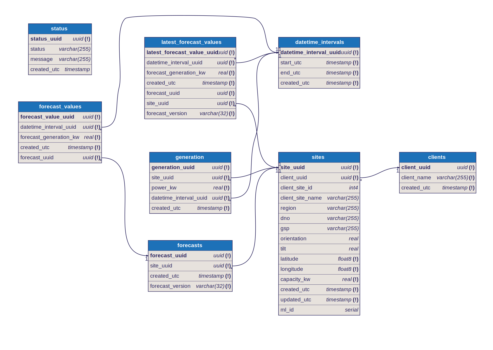

<h1 align="center">pvsite-datamodel</h1>
<p align="center">
    <a href="https://dbdocs.io/ocf/pvsite" alt="Interactive pvdatamodel documentation">
        </a>
    <a href="https://github.com/openclimatefix/pv-datamodel/issues?q=is%3Aissue+is%3Aopen+sort%3Aupdated-desc" alt="Issues">
        </a>
    <a href="https://github.com/openclimatefix/pv-datamodel/actions/workflows/generate-ddl.yml" alt="Code generation pipeline">
        </a>
    <a href="https://github.com/openclimatefix/pv-datamodel/actions/workflows/publish-docs.yml" alt="Documentation publishing pipeline">
        </a>
    <a href="https://github.com/badges/shields/graphs/contributors" alt="Contributors">
        </a>
</p>

Database schema specification for PV Site data.


## Repository structure

```yml
pvsite-datamodel:
  - pvsite.dbml # Ground-truth database specification for pvsite domain
  gen: # Folder containing auto-generated code
    - pvsite.sql # SQL specification of the pvsite datamodel
    - pvsite.py # SQLAlchemy specification of the pvsite datamodel
    - pvsite.svg # SVG diagramatic representation of the pvsite datamodel
  sdk: # Folder containing language specific ORM packages specific to this datamodel
    pvsite-python: # Python ORM code for reading/writing data from this model
```

## Database documentation

View the interactive database docs at https://dbdocs.io/ocf/pvsite.




## Generating SQL and SQLAlchemy

In repo, code generation is carried out by the gen-sqlalchemy github workflow.
To generate SQL and SQLAlchemy locally from the `.dbml` file, carry out the
following steps:

Install the [dbml cli tool](https://www.dbml.org/cli/#installation)

```bash
$ npm install -g @dbml/cli

# or if you're using yarn
$ yarn global add @dbml/cli
```

Use the tool to convert `.dbml` schema to SQL

```bash
$ dbml2sql pvsite.dbml -o pvsite.sql
```

This will have created all the CREATE TABLE statements required to build a
local version of the db.

For SQLAlchemy, install the python package O!MyModels

```bash
$ pip install omymodels
```

Use the package to convert the SQL to SQLAlchemy

```bash
$ omm pvsite.sql -t pvsite.py
```

Further reading:
    - https://xnuinside.medium.com/code-generation-how-to-generate-pydantic-sqlalchemy-ginoorm-models-from-sql-ddl-2c111b08b7a7


## Editing the datamodel

For syntax highlighting and hints in VSCode, use the
[https://marketplace.visualstudio.com/items?itemName=matt-meyers.vscode-dbml](vscode-dbml) plugin.
If you'd rather a live view of the tables as you edit, https://dbdiagram.io/d gives a realtime
visualisation of the datamodel.


## Pre-Commit

This repository implements a [pre-commit](https://pre-commit.com/#install) config that enables automatic fixes to code when you create a commit. This helps to maintin consistency in the main repo. To enable this, follow the [installation instructions on the precommit website](https://pre-commit.com/#install).
