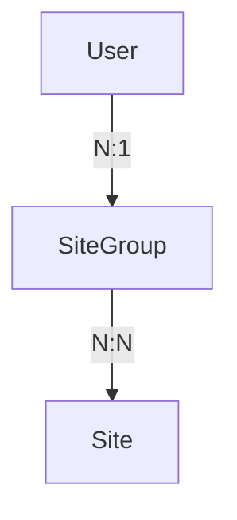
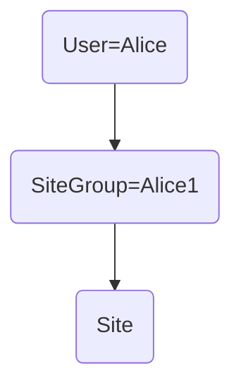
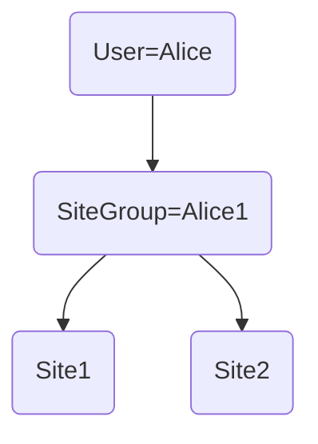
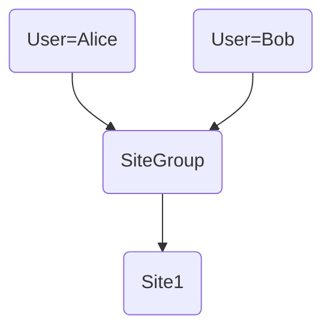
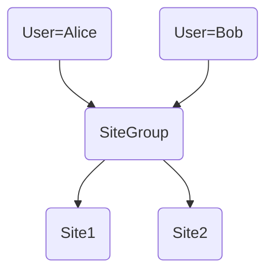
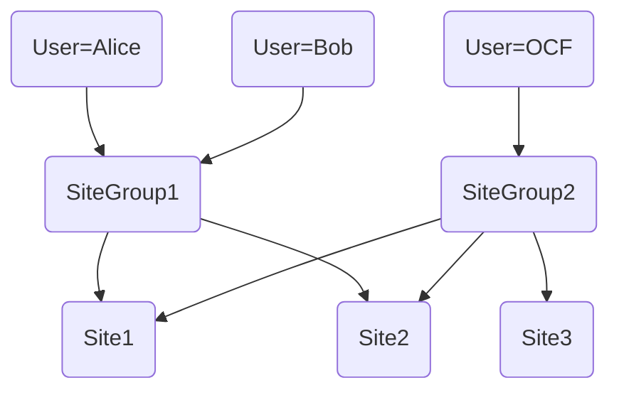

<h1 align="center">pvsite-datamodel</h1>
<p align="center">
    <a href="https://pypi.org/project/pvsite-datamodel/0.1.18/" alt="PyPi package">
        </a>
    <a href="https://github.com/openclimatefix/pv-datamodel/issues?q=is%3Aissue+is%3Aopen+sort%3Aupdated-desc" alt="Issues">
        </a>
    <a href="https://github.com/openclimatefix/pv-datamodel/graphs/contributors" alt="Contributors">
        </a>
</p>

Database schema specification for PV Site data.


## Repository structure

```yaml
pvsite_datamodel:
  read: # Sub package containing modules for reading from the database
  write: # Sub package containing modules for writing to the database
  - connection.py # Class for connecting to the database
  - sqlmodels.py # SQLAlchemy definitions of table schemas
tests: # External tests package
```

### Top-level functions

Classes specifying table schemas:
- APIRequestSQL
- GenerationSQL
- ForecastSQL
- ForecastValueSQL
- UserSQL
- SiteSQL
- SiteGroupSQL
- StatusSQL

Database connection objects:
- DatabaseConnection


### Read package functions

Currently available functions accessible via `from pvsite_datamodel.read import <func>`:

- get_user_by_email
- get_pv_generation_by_sites
- get_site_by_uuid
- get_site_by_client_site_id
- get_site_by_client_site_name
- get_all_sites
- get_site_group_by_name
- get_latest_status
- get_latest_forecast_values_by_site


### Write package functions

Currently available write functions accessible via `from pvsite_datamodels.write import <func>`:
- insert_generation_values
- make_user
- make_site
- make_site_group


## Install the dependencies (requires [poetry][poetry])

    poetry install


## Coding style

Format the code **in place**.

    make format

Lint the code

    make lint


## Running the tests

    make test

## Multiple Clients

We have the ability to have these different scenarios
1. one user - can add or view one site
2. one user, can add or view multiple sites
3. Two users (for example from the sample company), want to look at one site
4. Two users, wanting to look at multiple sites (could be added by another user). Any user from site group can add a site. 
5. OCF user want to see everything (admin)

### Solution

- One `user` is in one `sitegroup`. Each site group can have multiple users. 
- Each `sitegroup` contains multiple `sites`. One `site` can be in multiple `sitegroups`


### 1. one user - one site



### 2. one user - two sites



### 3. Two users - one site



### 4. Two users - two site



### 5. OCF can see everything




## Database migrations using alembic

[./alembic](./alembic)


[poetry]: https://python-poetry.org/
