<h1 align="center">pvsite-datamodel</h1>

<!-- ALL-CONTRIBUTORS-BADGE:START - Do not remove or modify this section -->
[](#contributors-)
<!-- ALL-CONTRIBUTORS-BADGE:END -->

<p align="center">
    <a href="https://github.com/openclimatefix/ocf-meta-repo?tab=readme-ov-file#overview-of-ocfs-nowcasting-repositories" alt="Ease of Contribution">
        </a>
    <a href="https://pypi.org/project/pvsite-datamodel/0.1.18/" alt="PyPi package">
        </a>
    <a href="https://github.com/openclimatefix/pv-datamodel/issues?q=is%3Aissue+is%3Aopen+sort%3Aupdated-desc" alt="Issues">
        </a>
    <a href="https://github.com/openclimatefix/pv-datamodel/graphs/contributors" alt="Contributors">
        </a>
</p>

Database schema specification for PV Site data.

## Repository structure

```yaml
pvsite_datamodel:
  read: # Sub package containing modules for reading from the database
  write: # Sub package containing modules for writing to the database
    - connection.py # Class for connecting to the database
    - sqlmodels.py # SQLAlchemy definitions of table schemas
tests: # External tests package
```

### Top-level functions

Classes specifying table schemas:

- APIRequestSQL
- GenerationSQL
- ForecastSQL
- ForecastValueSQL
- MLModelSQL
- UserSQL
- SiteSQL
- SiteGroupSQL
- StatusSQL
- ClientSQL

Database connection objects:

- DatabaseConnection

### Read and write package functions

- Read function currently accessible via `from pvsite_datamodel.read import <func>`.
- Write function Currently accessible via `from pvsite_datamodels.write import <func>`.

| **Read Package Functions**           | **Write Package Functions** |
| ------------------------------------ | --------------------------- |
| `get_user_by_email`                  | `insert_forecast_values`    |
| `get_pv_generation_by_sites`         | `insert_generation_values`  |
| `get_site_by_uuid`                   | `create_site`               |
| `get_site_by_client_site_id`         | `create_site_group`         |
| `get_site_by_client_site_name`       | `create_user`               |
| `get_sites_by_client_name`           | `create_client`             |
| `get_all_sites`                      | `make_fake_site`            |
| `get_sites_by_country`               | `add_site_to_site_group`    |
| `get_site_group_by_name`             | `change_user_site_group`    |
| `get_latest_status`                  | `update_user_site_group`    |
| `get_latest_forecast_values_by_site` | `edit_site`                 |
| `get_client_by_name`                 | `edit_client`               |
|                                      | `assign_site_to_client`     |
|                                      | `delete_site`               |
|                                      | `delete_user`               |
|                                      | `delete_site_group`         |

## Local Repository Setup(Linux)

This guide walks you through setting up the repository locally, installing dependencies. Follow the steps carefully to get your development environment up and running.

**Pre-requisite:** 
- Install [Poetry][poetry] for dependency management

- Install Pgadmin4 for database management

### Database Setup

Follow these steps to set up the database locally:

1. **Install PostgreSQL:**
Download and install PostgreSQL on your system : [Download PostgreSQL for Linux ](https://www.postgresql.org/download/linux/ubuntu/)


2. **Start PostgreSQL Service:**
```bash
sudo service postgresql start
```


3. **Check PostgreSQL Status:**
Ensure the service is running properly:
```bash
sudo service postgresql status
```


4. **Get Your Local IP Address:**
Copy the IP address to configure your connection:
```bash
hostname -I
```


5. **Create the Database:**
Use **pgAdmin 4** or the command line to create your database.


6. **Run Migrations with Alembic:**
Export the database URL and apply migrations:
```bash
export DB_URL="postgresql://<username>:<password>@<your_ip>:5432/<your_database>"
```


- **Note:** Replace the placeholders with your actual database credentials.

7. **Run the migrations:**
```bash

poetry run alembic upgrade head
```


### Steps to setup the repository locally

1. **Fork & Clone the Repository:**
```bash
git clone https://github.com/openclimatefix/pv-site-datamodel.git
```


2. **Navigate to the Repository:**
```bash
cd pv-site-datamodel
```

3. **Install Dependencies:**
```bash
poetry install
```


4. **Activate Virtual Environment:**
```bash
source .venv/bin/activate
```


5. **Set Database URL:**

Replace the placeholder with your actual database connection string.
```bash
export DB_URL="postgresql://<username>:<password>@<your_ip>:5432/<your_database>"
```


6. **Make Code Changes:**

Modify the necessary code files as needed.


7. **Format the Code:**
```bash
make format
```


8. **Lint the Code:**
```bash
make lint
```


---


## Running the tests

Run the following command to execute the test suite:

```bash
    make test
```


## PVSite Database Schema

```mermaid
---
title: SQLAlchemy relationships
---
classDiagram

    class UserSQL{
        + user_uuid : UUID ≪ PK ≫
        + email : String(255) ≪ U ≫
        + site_group_uuid : UUID ≪ FK ≫
    }
        class SiteGroupSQL{
        + site_group_uuid : UUID ≪ PK ≫
        + site_group_name : String(255) ≪ U ≫
        + service_level : Integer ≪ U ≫
    }

    class SiteGroupSiteSQL{
        + site_group_site_uuid : UUID ≪ PK ≫
        + site_group_uuid : UUID ≪ FK ≫
        + site_uuid : UUID ≪ FK ≫
    }

    class SiteSQL{
        + site_uuid : UUID ≪ PK ≫
        + client_site_id : Integer
        + client_site_name : String(255)
        + country : String(255) ≪ D ≫
        + region : String(255)
        + dno : String(255)
        + gsp : String(255)
        + asset_type : Enum ≪ D ≫
        + orientation : Float
        + tilt : Float
        + latitude : Float
        + longitude : Float
        + capacity_kw : Float
        + inverter_capacity_kw : Float
        + module_capacity_kw : Float
        + ml_id : Integer ≪ U ≫
        + client_uuid : UUID ≪ FK ≫
        + ml_model_uuid : UUID ≪ FK ≫
    }

    class ClientSQL{
        + client_uuid : UUID ≪ PK ≫
        + client_name : String(255)
    }

    class GenerationSQL{
        + generation_uuid : UUID ≪ PK ≫
        + site_uuid : UUID ≪ FK ≫
        + generation_power_kw : Float
        + start_utc : DateTime
        + end_utc : DateTime
    }

    class ForecastSQL{
        + forecast_uuid : UUID ≪ PK ≫
        + site_uuid : UUID ≪ FK ≫
        + timestamp_utc : DateTime
        + forecast_version : String(32)
    }

    class ForecastValueSQL{
        + forecast_value_uuid : UUID ≪ PK ≫
        + start_utc : DateTime
        + end_utc : DateTime
        + forecast_power_kw : Float
        + horizon_minutes : Integer
        + forecast_uuid : UUID ≪ FK ≫
    }

    class StatusSQL{
        + status_uuid : UUID ≪ PK ≫
        + status : String(255)
        + message : String(255)
    }

    class InverterSQL{
        + inverter_uuid : UUID ≪ PK ≫
        + site_uuid : UUID ≪ FK ≫
    }

    class APIRequestSQL{
        + uuid : UUID ≪ PK ≫
        + url : String
        + user_uuid : UUID ≪ FK ≫
    }

    class MLModelSQL{
        + uuid : UUID ≪ PK ≫
        + mode_name : String
        + model_version : UUID ≪ FK ≫
    }

    UserSQL "1" -- "N" SiteGroupSQL : belongs_to
    SiteGroupSQL "N" -- "N" SiteSQL : contains
    SiteGroupSQL "1" -- "N" SiteGroupSiteSQL : contains
    SiteSQL "1" -- "N" GenerationSQL : generates
    SiteSQL "1" -- "N" ForecastSQL : forecasts
    SiteSQL "N" -- "0" MLModelSQL : ml_model
    ForecastSQL "1" -- "N" ForecastValueSQL : contains
    MLModelSQL "1" -- "N" ForecastValueSQL : forecasts
    SiteSQL "1" -- "N" InverterSQL : contains
    UserSQL "1" -- "N" APIRequestSQL : performs_request
    ClientSQL "1" -- "N" SiteSQL : owns
    class Legend{
    UUID: Universally Unique Identifier
    PK: Primary Key
    FK: Foreign Key
    U: Unique Constraint
    D: Default Value
    }

```



## Multiple Clients

We have the ability to have these different scenarios

1. one user - can add or view one site
2. one user, can add or view multiple sites
3. Two users (for example from the sample company), want to look at one site
4. Two users, wanting to look at multiple sites (could be added by another user). Any user from site group can add a site.
5. OCF user want to see everything (admin)

### Solution


- One `user` is in one `sitegroup`. Each site group can have multiple users.
- Each `sitegroup` contains multiple `sites`. One `site` can be in multiple `sitegroups`

### 1. one user - one site


### 2. one user - two sites


### 3. Two users - one site


### 4. Two users - two site


### 5. OCF can see everything


## Database migrations using alembic

[./alembic](./alembic)

[poetry]: https://python-poetry.org/

## Contributors ✨

Thanks goes to these wonderful people ([emoji key](https://allcontributors.org/docs/en/emoji-key)):

<!-- ALL-CONTRIBUTORS-LIST:START - Do not remove or modify this section -->
<!-- prettier-ignore-start -->
<!-- markdownlint-disable -->
<table>
  <tbody>
    <tr>
      <td align="center" valign="top" width="14.28%"><a href="https://github.com/abhijelly"><br /><sub><b>Abhijeet</b></sub></a><br /><a href="https://github.com/openclimatefix/pv-site-datamodel/commits?author=abhijelly" title="Code">💻</a></td>
      <td align="center" valign="top" width="14.28%"><a href="https://github.com/devsjc"><br /><sub><b>devsjc</b></sub></a><br /><a href="https://github.com/openclimatefix/pv-site-datamodel/commits?author=devsjc" title="Code">💻</a></td>
      <td align="center" valign="top" width="14.28%"><a href="https://github.com/peterdudfield"><br /><sub><b>Peter Dudfield</b></sub></a><br /><a href="https://github.com/openclimatefix/pv-site-datamodel/commits?author=peterdudfield" title="Code">💻</a></td>
      <td align="center" valign="top" width="14.28%"><a href="https://confusedmatrix.com"><br /><sub><b>Chris Briggs</b></sub></a><br /><a href="https://github.com/openclimatefix/pv-site-datamodel/commits?author=confusedmatrix" title="Code">💻</a></td>
      <td align="center" valign="top" width="14.28%"><a href="http://racheltipton.dev"><br /><sub><b>rachel tipton</b></sub></a><br /><a href="https://github.com/openclimatefix/pv-site-datamodel/commits?author=rachel-labri-tipton" title="Code">💻</a></td>
      <td align="center" valign="top" width="14.28%"><a href="https://github.com/ericcccsliu"><br /><sub><b>Eric Liu</b></sub></a><br /><a href="https://github.com/openclimatefix/pv-site-datamodel/commits?author=ericcccsliu" title="Code">💻</a></td>
      <td align="center" valign="top" width="14.28%"><a href="https://github.com/braddf"><br /><sub><b>braddf</b></sub></a><br /><a href="https://github.com/openclimatefix/pv-site-datamodel/commits?author=braddf" title="Code">💻</a></td>
    </tr>
    <tr>
      <td align="center" valign="top" width="14.28%"><a href="https://github.com/bikramb98"><br /><sub><b>Bikram Baruah</b></sub></a><br /><a href="https://github.com/openclimatefix/pv-site-datamodel/commits?author=bikramb98" title="Code">💻</a></td>
      <td align="center" valign="top" width="14.28%"><a href="http://andrewlester.net"><br /><sub><b>Andrew Lester</b></sub></a><br /><a href="https://github.com/openclimatefix/pv-site-datamodel/commits?author=AndrewLester" title="Code">💻</a></td>
      <td align="center" valign="top" width="14.28%"><a href="https://github.com/suleman1412"><br /><sub><b>Suleman Karigar</b></sub></a><br /><a href="https://github.com/openclimatefix/pv-site-datamodel/commits?author=suleman1412" title="Code">💻</a></td>
      <td align="center" valign="top" width="14.28%"><a href="https://github.com/vishalj0501"><br /><sub><b>Vishal J</b></sub></a><br /><a href="https://github.com/openclimatefix/pv-site-datamodel/commits?author=vishalj0501" title="Tests">⚠️</a></td>
      <td align="center" valign="top" width="14.28%"><a href="https://github.com/ProfessionalCaddie"><br /><sub><b>Nicholas Tucker</b></sub></a><br /><a href="https://github.com/openclimatefix/pv-site-datamodel/commits?author=ProfessionalCaddie" title="Code">💻</a></td>
      <td align="center" valign="top" width="14.28%"><a href="https://github.com/PrabhasKalyan"><br /><sub><b>PrabhasKalyan</b></sub></a><br /><a href="https://github.com/openclimatefix/pv-site-datamodel/commits?author=PrabhasKalyan" title="Code">💻</a></td>
      <td align="center" valign="top" width="14.28%"><a href="https://github.com/hanaawad24"><br /><sub><b>hanaawad24</b></sub></a><br /><a href="https://github.com/openclimatefix/pv-site-datamodel/commits?author=hanaawad24" title="Documentation">📖</a> <a href="https://github.com/openclimatefix/pv-site-datamodel/commits?author=hanaawad24" title="Tests">⚠️</a></td>
    </tr>
    <tr>
      <td align="center" valign="top" width="14.28%"><a href="https://github.com/mduffin95"><br /><sub><b>Matthew Duffin</b></sub></a><br /><a href="https://github.com/openclimatefix/pv-site-datamodel/commits?author=mduffin95" title="Code">💻</a></td>
      <td align="center" valign="top" width="14.28%"><a href="https://github.com/MAYANK12SHARMA"><br /><sub><b>MAYANK SHARMA</b></sub></a><br /><a href="https://github.com/openclimatefix/pv-site-datamodel/commits?author=MAYANK12SHARMA" title="Tests">⚠️</a></td>
      <td align="center" valign="top" width="14.28%"><a href="https://www.linkedin.com/in/ruth-velasquez070/"><br /><sub><b>Ruth Velasquez</b></sub></a><br /><a href="#ideas-abillama05" title="Ideas, Planning, & Feedback">🤔</a></td>
      <td align="center" valign="top" width="14.28%"><a href="https://github.com/Praneeth-Suresh"><br /><sub><b>Praneeth Suresh</b></sub></a><br /><a href="https://github.com/openclimatefix/pv-site-datamodel/commits?author=Praneeth-Suresh" title="Code">💻</a></td>
    </tr>
  </tbody>
</table>

<!-- markdownlint-restore -->
<!-- prettier-ignore-end -->

<!-- ALL-CONTRIBUTORS-LIST:END -->

This project follows the [all-contributors](https://github.com/all-contributors/all-contributors) specification. Contributions of any kind welcome!
